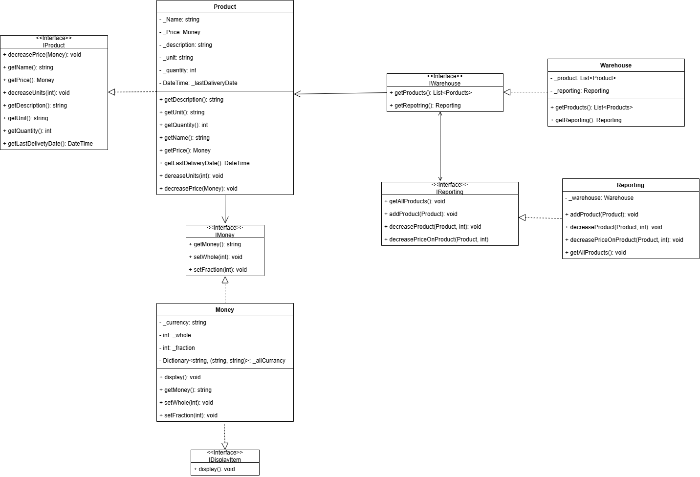

# lab1
## The principles I used:
### Single Responsibility Principle
Each class is responsible for one responsibility:
- [Product](./lab1_kpz/classes/Product.cs) – responsible for product data (name, price, quantity, etc.).
- [Money](./lab1_kpz/classes/Money.cs) – is responsible for the processing of monetary units and currencies.
- [Reporting](./lab1_kpz/classes/Reporting.cs) – responsible for displaying reports and operations on products (add, reduce, etc.).
- [Warehouse](./lab1_kpz/classes/Warehouse.cs) – manages the product list and interacts with reports.
```
public class Product : IProduct
{
    private string _Name { get; set; }
    private Money _Price { get; set; }
    private int _quantity { get; set; }

    public Product(string name, Money price, int quantity)
    {
        _Name = name;
        _Price = price;
        _quantity = quantity;
    }

    public string getName() => _Name;
    public Money getPrice() => _Price;
    public int getQuantity() => _quantity;
}
```
### Open/Closed Principle
- Classes are closed to modifications, but open to extensions. For [example](./lab1_kpz/classes/Reporting.cs#L48-L60), to add new product operations, you can create a new class without modifying existing ones.
### Liskov Substitution Principle
- Using interfaces ([IProduct](./lab1_kpz/interfaces/IProduct.cs), [IMoney](./lab1_kpz/interfaces/IMoney.cs), [IReporting](./lab1_kpz/interfaces/IReporting.cs)) allows replacing implementations without changing the logic. For [example](./lab1_kpz/classes/Money.cs#L5-L9), you can create another class that implements IMoney and use that instead of Money.
### Interface Segregation Principle
- Interfaces are divided by functionality: [IDisplayItem](./lab1_kpz/interfaces/IDisplayItem.cs), [IMoney](./lab1_kpz/interfaces/IMoney.cs), [IProduct](./lab1_kpz/interfaces/IProduct.cs), [IReporting](./lab1_kpz/interfaces/IReporting.cs), [IWarehouse](./lab1_kpz/interfaces/IWarehouse.cs). This allows you to implement only the [necessary methods](./lab1_kpz/interfaces/IProduct.cs#L5-L10) in each class.
### Dependency Inversion Principle
- [Reporting](./lab1_kpz/classes/Reporting.cs) depends on the abstraction ([IWarehouse](./lab1_kpz/interfaces/IWarehouse.cs)) rather than the concrete implementation of [Warehouse](./lab1_kpz/classes/Warehouse.cs), which improves testability and extensibility of the code.
```
public class Reporting : IReporting
{
    private IWarehouse _warehouse;

    public Reporting(IWarehouse warehouse)
    {
        _warehouse = warehouse;
    }
}
```
### DRY (Don`t Repeat Yourself)
- Transferring common logic to individual methods, for example, [getMoney()](./lab1_kpz/classes/Money.cs#L29-L32) in the [Money](./lab1_kpz/classes/Money.cs) class. This prevents code duplication
### KISS (Keep It Simple, Stupid)
- The structure of the code is simple and clear. Each class and [method](./lab1_kpz/classes/Product.cs#L24-L32) has a clear functionality and is not overloaded with unnecessary logic
# UML
